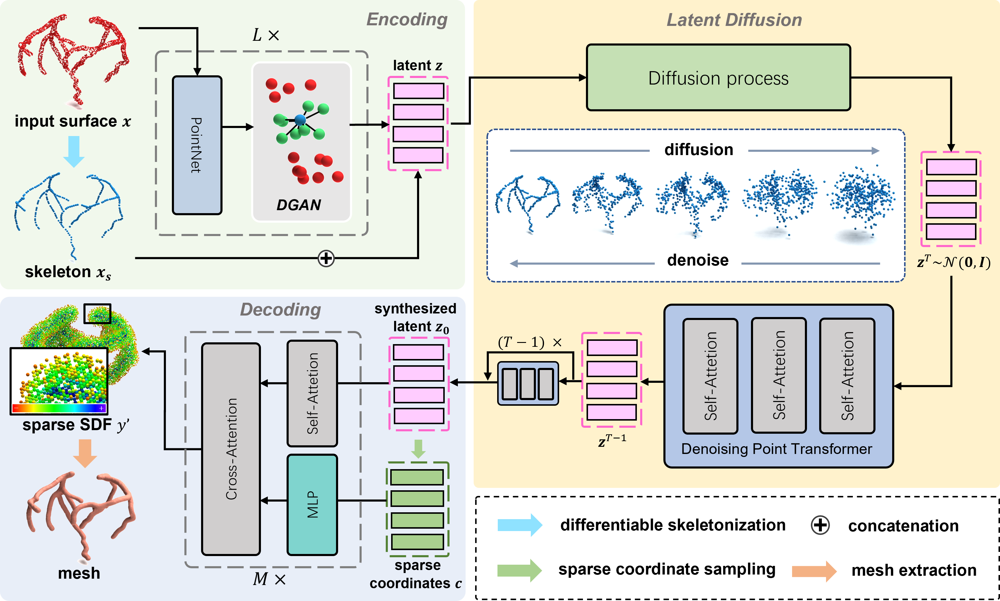
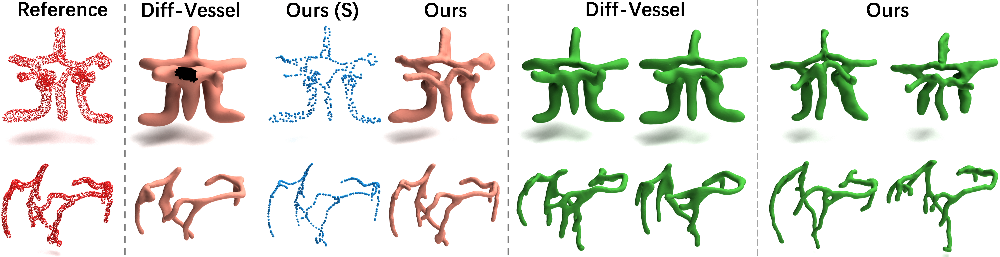

# High-Fidelity Medical Shape Generation via Skeletal Latent Diffusion



## Overview

You are visiting MeShaGe, a skeletal latent diffusion framework that explicitly incorporates structural priors for efficient and high-fidelity MEdical SHApe GEneration.  This is the official code repository for our paper "[High-Fidelity Medical Shape Generation via Skeletal Latent Diffusion](https://arxiv.org/abs/2603.07504)".

## Get Started with MeShaGe

### Requirement list
MeShaGe is built on [flemme](https://github.com/wlsdzyzl/flemme), which is a modular learning platform for medical images. Please see its documentation for installation. Note that if you want to use MeShaGe, you have to enable `point-cloud` and `transformer` modules in the [config.py](https://github.com/wlsdzyzl/flemme/blob/main/flemme/config.py) of flemme.

You also need to install [PyTMCubes](https://github.com/wlsdzyzl/PyTMCubes) for mesh extraction.

After installing flemme and PyTMCubes, type the following commands to set up MeShaGe to your environment:
```
Git clone from git@github.com:wlsdzyzl/meshage.git
cd meshage
python setup.py install
```

### Usage

MeShaGe follows the architectural design of flemme. To create a deep learning model of MeShaGe, you just need to define the model and training parameters in a configuration file. See an example file at [train_spae.yaml](./resources/spcnn/train_spae_cnn_condition_config_wo_lpc.yaml)

#### Supported Auto-encoder

MeShaGe supports 3 types of encoders that map point clouds to SDF.

`SPSDFCNN` denotes the encoder using sparse surface points with hierarchical features as latent points. 

`SKSDFCNN` denotes the encoder using skeletal latent points.

`SKSPSDFCNN` denotes the encoder using sparse surface and skeletal latent points.

We recommend starting with an `SPSDFCNN` encoder, as it is easy and fast to train and typically achieves satisfactory reconstruction results.


#### Supported Auto-encoder

MeShaGe supports 3 types of encoders that map point clouds to SDF.

`SPSDFCNN` denotes the encoder using sparse surface points with hierarchical features as latent points. 

`SKSDFCNN` denotes the encoder using skeletal latent points.

`SKSPSDFCNN` denotes the encoder using sparse surface and skeletal latent points.

We recommend starting with an `SPSDFCNN` encoder, as it is easy and fast to train and typically achieves satisfactory reconstruction results.

#### Training

The training of meshage models involves two stages. First, we need to train an auto-encoder. 
```
train_meshage --config ./resources/spcnn/train_spae_cnn_condition_config_wo_lpc.yaml
```

Then, we need to train a diffusion model on the learned latents.
```
# get the learned latents
test_meshage --config ./resources/spcnn/test_spae_cnn_condition_config_wo_lpc_for_train.yaml
train_meshage --config ./resources/spcnn/train_edm_spcnn_condition_config_wo_lpc.yaml
```

#### Test

To test a latent diffusion model, you need a test configuration file, which specifies the parameters and paths of the auto-encoder and diffusion model. 

```
test_meshage --config ./resources/spcnn/test_ldm_spcnn_condition_config_wo_lpc.yaml
```

You can also test the trained auto-encoder:
```
test_meshage --config ./resources/spcnn/test_spae_cnn_condition_config_wo_lpc.yaml
```

## Results
### *MedSDF* Dataset

The MedSDF dataset is a large-scale medical shape dataset containing 12,472 samples across 14 anatomical structure categories for category-conditioned shape reconstruction and generation. Each sample comprises a raw point cloud, an SDF volume of 100×100×100, and a reconstructed surface mesh. Specifically, we process over 10,000 samples covering 12 anatomical structure categories from MedShapeNet and compute their corresponding SDF volumes (codes can be found at [scripts](./scripts/generate_sdf_from_mesh.py)). To further expand morphological diversity, we incorporate vessel data from ImageCAS, and each coronary artery shape is segmented into left and right branches. In our experiment, we randomly split the dataset into 5 folds, with 90% and 10% of the samples from the first 4 folds used for training and validation, respectively. The remaining 5th fold is reserved for testing. The dataset is available at [MedSDF]().


#### Reconstruction

#### Generation


### Vessel Datasets (CoW and ImageCAS)


## Bibex

If you find our project helpful, please consider to cite the following works:

[1] High-Fidelity Medical Shape Generation through Skeletal Latent Diffusion.
```
@misc{zhang2026highfidelitymedicalshapegeneration,
      title={High-Fidelity Medical Shape Generation via Skeletal Latent Diffusion}, 
      author={Guoqing Zhang and Jingyun Yang and Siqi Chen and Anping Zhang and Yang Li},
      year={2026},
      eprint={2603.07504},
      archivePrefix={arXiv},
      primaryClass={cs.CV},
      url={https://arxiv.org/abs/2603.07504}, 
}
```
[2] Hierarchical Feature Learning for Medical Point Clouds via State Space Model; MICCAI 2025.
```
@misc{zhang2024flemmeflexiblemodularlearning,
      title={Flemme: A Flexible and Modular Learning Platform for Medical Images}, 
      author={Guoqing Zhang and Jingyun Yang and Yang Li},
      year={2024},
      eprint={2408.09369},
      archivePrefix={arXiv},
      primaryClass={eess.IV},
      url={https://arxiv.org/abs/2408.09369}, 
}
```
## Acknowledgement

Thanks [EDM](https://github.com/NVlabs/edm), [LaGeM](https://github.com/1zb/LaGeM), and [GeM3D](https://github.com/lodurality/GEM3D_paper_code) for their wonderful works.

